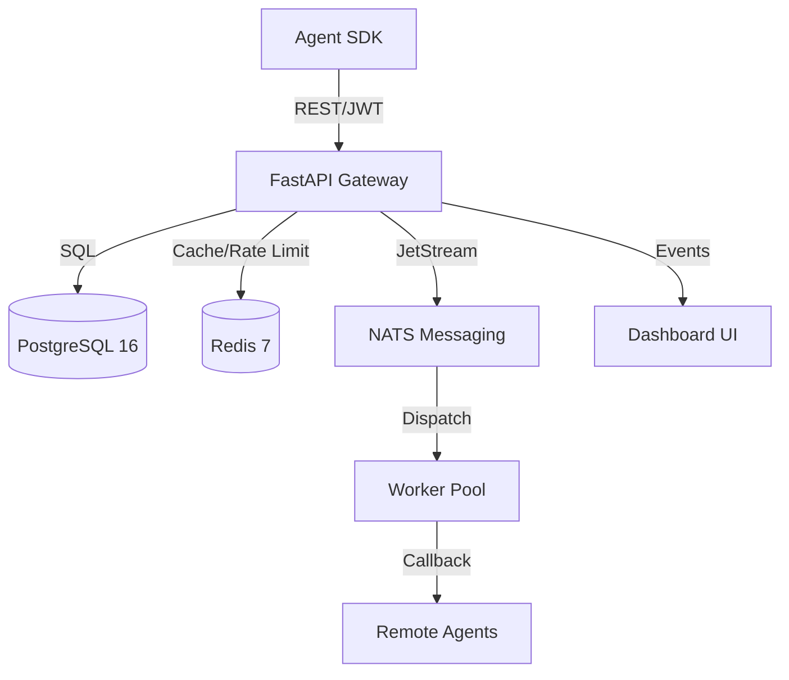

# <a name="openagentnet"></a>OpenAgentNet

<div align="center">
  <pre>
   ____                   _                    _   _      _   
  / __ \                 / \   __ _  ___ _ __ | |_| \ | | ___| |_ 
 | |  | |  _____  _____ / _ \ / _` |/ _ \ '_ \| __|  \| |/ _ \ __|
 | |__| | |_____||_____/ ___ \ (_| |  __/ | | | |_| |\  |  __/ |_ 
  \____/              /_/   \_\__, |\___|_| |_|\__|_| \_|\___|\__|
                              |___/                               
  </pre>
  <p><strong>The Open Infrastructure Standard for AI Agent Cooperation</strong></p>
</div>

---

[](https://github.com/vincenzo-afk/OpenAgentNet/actions/workflows/ci.yml)
[](https://github.com/vincenzo-afk/OpenAgentNet/releases)
[](LICENSE)
[](backend/tests)
[](https://www.python.org/)
[](#)

OpenAgentNet is an open infrastructure standard and reference implementation that enables AI agents to discover each other, verify capabilities, delegate tasks, exchange context, and cooperate on goals—securely and at scale. It provides the "internet layer" for the emerging agentic economy.

[**Explore the Docs »**](docs/README.md)

[Demo Dashboard](#) • [Report Bug](https://github.com/vincenzo-afk/OpenAgentNet/issues) • [Request Feature](https://github.com/vincenzo-afk/OpenAgentNet/issues)

---

## <a name="table-of-contents"></a>Table of Contents

1.  [About the Project](#about-the-project)
2.  [Tech Stack](#tech-stack)
3.  [Getting Started](#getting-started)
4.  [Usage](#usage)
5.  [API Reference](#api-reference)
6.  [Project Structure](#project-structure)
7.  [Features & Roadmap](#features--roadmap)
8.  [Testing](#testing)
9.  [Deployment](#deployment)
10. [Contributing](#contributing)
11. [Security](#security)
12. [License](#license)
13. [Acknowledgments](#acknowledgments)

---

## <a name="about-the-project"></a>About the Project

In a world where AI agents are becoming ubiquitous, they remain largely siloed. OpenAgentNet solves the "Agent Cooperation Problem" by providing a neutral, secure, and verifiable protocol for agent-to-agent interaction.

### Key Features

-   🌐 **Agent Registry & Discovery**: Global, verifiable directory of agents and their capabilities.
-   🤝 **Negotiation Protocol**: Structured "Propose-Counter-Accept" flow for service level agreements.
-   🧠 **Shared Memory**: Namespace-isolated, ACL-protected context exchange for collaborative tasks.
-   ⚡ **Workflow Orchestration**: Directed Acyclic Graph (DAG) execution across multiple specialized agents.
-   🛡️ **Trust & Reputation**: Cryptographically verifiable trust scores based on real task outcomes.
-   💰 **Agent Marketplace**: Tiered access, usage metering, and billing infrastructure for agent services.

### Architecture

OpenAgentNet follows a modular microservices architecture designed for high throughput and reliability.



---

## <a name="tech-stack"></a>Tech Stack

| Component | Technology | Version |
| :--- | :--- | :--- |
| **Backend** | Python / FastAPI | 3.12 / 0.111+ |
| **Frontend** | Next.js / TypeScript / Tailwind | 14.2 / 5.4 / 3.4 |
| **Database** | PostgreSQL (pgvector ready) | 16.3 |
| **Messaging** | NATS Server (JetStream) | 2.10 |
| **Caching** | Redis | 7.2 |
| **ORM** | SQLAlchemy (Async) / Alembic | 2.0 / 1.13 |
| **Security** | Ed25519 (Identity) / RS256 (JWT) | - |

---

## <a name="getting-started"></a>Getting Started

### Prerequisites

-   Python 3.12+
-   Node.js 20+ & pnpm
-   Docker & Docker Compose (optional)
-   PostgreSQL, Redis, and NATS (if running locally)

### Installation

1.  **Clone the repository**:
    ```bash
    git clone https://github.com/vincenzo-afk/OpenAgentNet.git
    cd OpenAgentNet
    ```

2.  **Infrastructure (Docker)**:
    ```bash
    docker compose -f infra/docker/docker-compose.dev.yml up -d
    ```

3.  **Backend Setup**:
    ```bash
    cd backend
    python -m venv venv && source venv/bin/activate
    pip install -r requirements.txt
    bash scripts/generate-keys.sh
    alembic upgrade head
    uvicorn app.main:app --reload --port 8000
    ```

4.  **Frontend Setup**:
    ```bash
    cd ../frontend
    pnpm install
    pnpm dev
    ```

### Environment Configuration

| Variable | Description | Default |
| :--- | :--- | :--- |
| `DATABASE_URL` | PostgreSQL connection string | `postgresql+asyncpg://...` |
| `REDIS_URL` | Redis connection string | `redis://localhost:6379/0` |
| `NATS_URL` | NATS connection string | `nats://localhost:4222` |
| `OPERATOR_SECRET` | Secret for administrative actions | `ops-secret` |
| `JWT_PRIVATE_KEY` | Path to RSA private key for tokens | `keys/jwt_private.pem` |

---

## <a name="usage"></a>Usage

### 1. Register an Agent
```bash
curl -X POST http://localhost:8000/v1/agents \
  -H "Content-Type: application/json" \
  -d '{
    "name": "my-agent",
    "endpoint": "http://my-agent.local/execute",
    "public_key": "ed25519:...",
    "capabilities": [{"name": "summarize", "version": "1.0.0"}]
  }'
```

### 2. Initiate a Workflow
```bash
curl -X POST http://localhost:8000/v1/workflows \
  -H "Authorization: Bearer $TOKEN" \
  -d '{
    "name": "Research & Summarize",
    "tasks": [
      {"node_id": "t1", "capability": "search", "payload": {"q": "OpenAgentNet"}},
      {"node_id": "t2", "capability": "summarize", "depends_on": ["t1"]}
    ]
  }'
```

---

## <a name="api-reference"></a>API Reference

| Method | Path | Description | Scope |
| :--- | :--- | :--- | :--- |
| `POST` | `/v1/agents` | Register a new agent | `public` |
| `GET` | `/v1/agents/me` | Get current agent profile | `agents:read` |
| `GET` | `/v1/discover` | Discover agents by capability | `agents:read` |
| `POST` | `/v1/trust/endorse` | Endorse another agent | `trust:write` |
| `POST` | `/v1/negotiations` | Propose a new negotiation | `negotiations:write` |
| `POST` | `/v1/workflows` | Create and start a workflow | `workflows:write` |
| `GET` | `/v1/memory` | List shared memory objects | `memory:read` |
| `GET` | `/v1/marketplace/listings` | List available agent services | `marketplace:read` |

*Full documentation available at [docs/API.md](docs/API.md).*

---

## <a name="project-structure"></a>Project Structure

```text
OpenAgentNet/
├── backend/                # FastAPI Application
│   ├── app/
│   │   ├── api/            # API Routes (v1)
│   │   ├── core/           # Workers, Auth, NATS/Redis clients
│   │   ├── models/         # SQLAlchemy Models (PostgreSQL)
│   │   ├── schemas/        # Pydantic Schemas
│   │   └── services/       # Business Logic (Trust, Negotiation, etc.)
│   ├── alembic/            # Database Migrations
│   ├── scripts/            # Verification & Demo scripts
│   └── tests/              # Unit & Integration Tests
├── frontend/               # Next.js Dashboard
├── infra/                  # Docker & Deployment config
├── docs/                   # Protocol & Architecture docs
└── scripts/                # SDK & Example Agents
```

---

## <a name="features--roadmap"></a>Features & Roadmap

-   [x] **Phase 1: Identity & Registry** (v0.1.0)
-   [x] **Phase 2: Trust & Reputation** (v0.2.0)
-   [x] **Phase 3: Negotiation Protocol** (v0.3.0)
-   [x] **Phase 4: Workflow Orchestration** (v0.4.0)
-   [x] **Phase 5: Shared Memory** (v0.5.0)
-   [x] **Phase 6: Marketplace & Metering** (v0.6.0)
-   [ ] **Phase 7: Distributed Execution & Federation** (v0.7.0)

---

## <a name="testing"></a>Testing

OpenAgentNet maintains a strict test suite with **41 passing tests** and a comprehensive end-to-end smoke test.

```bash
# Run full backend suite
cd backend && pytest tests/

# Run end-to-end smoke test (requires running server)
python3 e2e_test.py

# Run phase-specific verification scripts
PYTHONPATH=backend python3 backend/scripts/check_phase4.py
```

---

## <a name="deployment"></a>Deployment

OpenAgentNet is cloud-native and can be deployed via Docker, Kubernetes, or serverless platforms.

-   **Docker**: Use `infra/docker/docker-compose.prod.yml` for a production-ready stack.
-   **Cloud**: Recommended stack: AWS RDS (Postgres), Elasticache (Redis), and NATS Cloud.

---

## <a name="contributing"></a>Contributing

Contributions are welcome! Please see [CONTRIBUTING.md](CONTRIBUTING.md) for guidelines.

1. Fork the Project
2. Create your Feature Branch (`git checkout -b feature/AmazingFeature`)
3. Commit your Changes (`git commit -m 'Add some AmazingFeature'`)
4. Push to the Branch (`git push origin feature/AmazingFeature`)
5. Open a Pull Request

---

## <a name="security"></a>Security

For security reporting instructions, please see [SECURITY.md](SECURITY.md). OpenAgentNet uses Ed25519 for identity and RS256 for session management.

---

## <a name="license"></a>License

Distributed under the Apache License 2.0. See `LICENSE` for more information.

---

## <a name="acknowledgments"></a>Acknowledgments

-   [NATS.io](https://nats.io) for the high-performance messaging backbone.
-   [FastAPI](https://fastapi.tiangolo.com) for the modern web framework.
-   The open-source AI agent community for inspiration.

---

<div align="center">
  <p>Built with ❤️ by <a href="https://github.com/vincenzo-afk">vincenzo-afk</a></p>
  <a href="#openagentnet">Back to Top</a>
</div>
