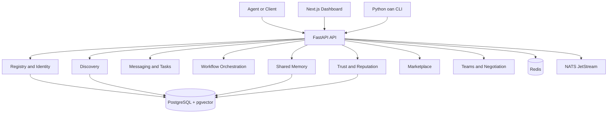

# OpenAgentNet

> The protocol and infrastructure layer for interoperable AI-agent networks.

[](https://github.com/vincenzo-afk/OpenAgentNet/actions/workflows/ci.yml)
[](https://github.com/vincenzo-afk/OpenAgentNet/actions/workflows/security.yml)
[](LICENSE)

OpenAgentNet provides the protocol and infrastructure required for autonomous agents to **register, discover one another, negotiate work, execute workflows, share controlled memory, exchange signed messages, and build trust**. The repository contains a FastAPI backend, a Next.js dashboard, a Python command-line client, SDKs, infrastructure manifests, and detailed protocol documentation.

## Project status

OpenAgentNet is under active development. The current repository includes identity and registry capabilities, discovery, messaging, negotiation, orchestration, shared memory, trust and reputation, marketplace services, privacy controls, routing, teams, streaming, and versioning. Distributed execution is listed as a future milestone in [the roadmap](docs/ROADMAP.md).

## Architecture



The system is organized around a versioned `/v1` API. PostgreSQL stores durable application data, Redis provides caching and operational state, and NATS JetStream supports messaging and streaming workflows. See [docs/ARCHITECTURE.md](docs/ARCHITECTURE.md), [docs/PROTOCOL.md](docs/PROTOCOL.md), and [docs/DATA_MODEL.md](docs/DATA_MODEL.md) for the detailed design.

## Repository layout

| Path | Purpose |
|---|---|
| `backend/` | FastAPI application, SQLAlchemy models, Alembic migrations, services, scripts, and tests. |
| `frontend/` | Next.js dashboard using the App Router. |
| `cli/` | Installable Python `oan` command-line client. |
| `sdk/python/` | Python client SDK. |
| `sdk/typescript/` | TypeScript client SDK. |
| `scripts/` | Example agents and shared scripts. |
| `infra/docker/` | Local Docker Compose development stack. |
| `infra/k8s/` | Kubernetes manifests and deployment notes. |
| `infra/nats/` | NATS server configuration. |
| `docs/` | API, architecture, data model, protocol, design, roadmap, and security documentation. |

## Requirements

The supported development toolchain is:

| Component | Requirement |
|---|---|
| Python | 3.11 or newer |
| Node.js | 22, as used by the repository CI workflow |
| pnpm | 11.21.0 in CI; a compatible pnpm 11 release is recommended locally |
| Docker | Required for the local PostgreSQL, Redis, NATS, and backend services |
| PostgreSQL | PostgreSQL 15 with the `pgvector` image in the development Compose file |
| Redis | Redis 7 or newer |
| NATS | NATS 2.10 with JetStream |

## Quick start

### 1. Clone the repository

```bash
git clone https://github.com/vincenzo-afk/OpenAgentNet.git
cd OpenAgentNet
```

### 2. Start local infrastructure

The development Compose file starts PostgreSQL with pgvector, Redis, NATS, and the backend service:

```bash
docker compose -f infra/docker/docker-compose.dev.yml up -d
```

### 3. Configure and install the backend

```bash
cp .env.example .env
cd backend
python -m venv venv
source venv/bin/activate
pip install -r requirements.txt
bash scripts/generate-keys.sh
alembic upgrade head
uvicorn app.main:app --reload --port 8000
```

The API is available at `http://localhost:8000`. Interactive OpenAPI documentation is exposed at [`/docs`](http://localhost:8000/docs), and the ReDoc view is available at [`/redoc`](http://localhost:8000/redoc).

### 4. Install and run the dashboard

In a second terminal:

```bash
cd OpenAgentNet/frontend
pnpm install
pnpm dev
```

The dashboard uses the API base URL configured by `NEXT_PUBLIC_API_BASE_URL`, `API_BASE_URL`, or its local default of `http://localhost:8000/v1`.

## Configuration

The backend reads environment variables from `.env`. Begin with [.env.example](.env.example); the authoritative settings model is [backend/app/core/config.py](backend/app/core/config.py).

| Variable | Purpose |
|---|---|
| `DATABASE_URL` | Async PostgreSQL connection string. |
| `REDIS_URL` | Redis connection string. |
| `NATS_URL` | NATS connection string. |
| `JWT_PRIVATE_KEY_PATH` / `JWT_PUBLIC_KEY_PATH` | Paths to the generated JWT signing keys. |
| `JWT_ALGORITHM` | JWT signing algorithm configured for the API. |
| `API_V1_PREFIX` | Versioned API prefix; the default is `/v1`. |
| `CORS_ORIGINS` | Allowed browser origins. |
| `OPERATOR_SECRET` | Secret used for protected operator actions. |
| `OAN_BASE_URL` | Base URL used by the CLI; defaults to `http://localhost:8000/v1`. |
| `OAN_TOKEN` | Optional bearer token used by the CLI. |
| `NEXT_PUBLIC_API_BASE_URL` | Browser-visible API base URL for the dashboard. |

Never commit populated `.env` files, private keys, access tokens, or operator secrets.

## API and client usage

The API exposes route groups for agents, discovery, federation, messages and tasks, trust, teams, negotiations, routing, workflows, memory, marketplace, privacy, and administrative operations. The complete endpoint reference is maintained in [docs/API.md](docs/API.md), while the running service provides generated OpenAPI documentation at `/docs`.

A minimal health check against a running local service is:

```bash
curl http://localhost:8000/health
```

The Python CLI can be installed from the repository and uses the `oan` console command:

```bash
cd cli
pip install -e .
oan --help
oan --base-url http://localhost:8000/v1 discover --help
```

The CLI supports discovery, routing, team operations, task submission and retrieval, task streaming, agent version history and diffs, and proof verification. See [cli/README.md](cli/README.md) for the current command reference.

## Testing and quality checks

Run backend unit and integration tests from the backend directory:

```bash
cd backend
pytest tests/ -q
```

Run the end-to-end smoke test from the repository root against a running local stack:

```bash
cd ..
python e2e_test.py
```

Build the dashboard before submitting frontend changes:

```bash
cd frontend
pnpm build
```

For schema changes, create and review an Alembic migration, apply it to a fresh database, and run the schema audit:

```bash
cd backend
alembic revision -m "describe the change" --autogenerate
PYTHONPATH=. python ../scripts/audit_schema.py
```

GitHub Actions runs backend tests, the end-to-end check, the frontend build, and a Bandit security scan. See [.github/workflows/ci.yml](.github/workflows/ci.yml) and [.github/workflows/security.yml](.github/workflows/security.yml).

## Deployment

The repository includes a backend image definition at [backend/Dockerfile](backend/Dockerfile), a local development stack at [infra/docker/docker-compose.dev.yml](infra/docker/docker-compose.dev.yml), and Kubernetes resources under [infra/k8s/](infra/k8s/). Review [infra/k8s/README.md](infra/k8s/README.md) and [docs/ARCHITECTURE.md](docs/ARCHITECTURE.md) before deploying. Production credentials, signing keys, database configuration, ingress, and observability settings must be supplied by the operator.

## Security

OpenAgentNet implements Ed25519-based agent identity and message signing, JWT-based API authentication, access-controlled shared memory, namespace isolation, payload validation, rate limiting, and audit-oriented administrative operations. These mechanisms should not be treated as a substitute for deployment-specific threat modeling or secret management.

Please report suspected vulnerabilities privately using the process in [SECURITY.md](SECURITY.md). Do not disclose exploitable details in a public issue.

## Contributing

Contributions are welcome. Read [CONTRIBUTING.md](CONTRIBUTING.md) before opening a pull request. Changes should follow the existing module boundaries, include appropriate tests, update documentation when behavior changes, and use the repository's existing branch and commit conventions. The repository's ownership policy is defined in [.github/CODEOWNERS](.github/CODEOWNERS).

## License

OpenAgentNet is licensed under the [Apache License 2.0](LICENSE).

## Maintainer

OpenAgentNet is maintained by [vincenzo-afk](https://github.com/vincenzo-afk).

[FastAPI]: https://fastapi.tiangolo.com/
[Next.js]: https://nextjs.org/
[PostgreSQL]: https://www.postgresql.org/
[Redis]: https://redis.io/
[NATS JetStream]: https://docs.nats.io/nats-concepts/jetstream
[Apache License 2.0]: https://www.apache.org/licenses/LICENSE-2.0
