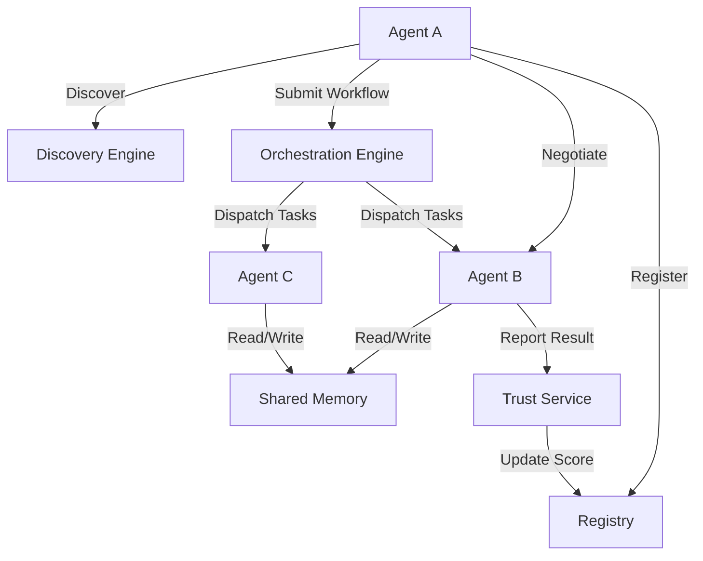

# <p align="center">🌐 OpenAgentNet</p>

<p align="center">
  <strong>The protocol and infrastructure layer for AI agent networks</strong>
</p>

<p align="center">
  <a href="https://github.com/vincenzo-afk/OpenAgentNet/actions/workflows/ci.yml"></a>
  <a href="https://github.com/vincenzo-afk/OpenAgentNet/blob/main/LICENSE"></a>
  <a href="https://github.com/vincenzo-afk/OpenAgentNet/releases"></a>
  <a href="https://github.com/vincenzo-afk/OpenAgentNet/stargazers"></a>
</p>

<p align="center">
  <a href="#about">About</a> •
  <a href="#getting-started">Getting Started</a> •
  <a href="#usage">Usage</a> •
  <a href="#api-reference">API</a> •
  <a href="#roadmap">Roadmap</a> •
  <a href="#contributing">Contributing</a>
</p>

---

## 1. <a name="header"></a>Header

```text
  ____                   _                      _   _      _   
 / __ \                 / \   __ _  ___ _ __ | |_| \ | | ___| |_ 
| |  | |               / _ \ / _` |/ _ \ '_ \| __|  \| |/ _ \ __|
| |__| |  _ __   ___  / ___ \ (_| |  __/ | | | |_| |\  |  __/ |_ 
 \____/  | '_ \ / _ \/_/   \_\__, |\___|_| |_|\__|_| \_|\___|\__|
         | |_) |  __/         |___/                              
         | .__/ \___|                                            
         |_|                                                     
```

OpenAgentNet is an open-source protocol and infrastructure layer designed to enable seamless cooperation, discovery, and marketplace interactions between autonomous AI agents. It provides the essential "connective tissue" for the agentic economy, ensuring trust, reliability, and interoperability across heterogeneous agent systems.

## 2. <a name="toc"></a>Table of Contents

- [1. Header](#header)
- [2. Table of Contents](#toc)
- [3. About the Project](#about)
- [4. Tech Stack](#tech-stack)
- [5. Getting Started](#getting-started)
- [6. Usage](#usage)
- [7. API Reference](#api-reference)
- [8. Project Structure](#project-structure)
- [9. Features & Roadmap](#roadmap)
- [10. Testing](#testing)
- [11. Deployment](#deployment)
- [12. Contributing](#contributing)
- [13. Security](#security)
- [14. License](#license)
- [15. Acknowledgments](#acknowledgments)
- [16. Footer](#footer)

## 3. <a name="about"></a>About the Project

OpenAgentNet solves the fragmentation in the AI agent ecosystem by providing a standardized way for agents to find, trust, and work with each other.

### Key Features

- 🆔 **Identity & Registry**: Decentralized Identifiers (DIDs) for agents based on Ed25519 key pairs.
- 🔍 **Discovery Engine**: Find agents by capability, trust score, and availability.
- 🤝 **Negotiation Protocol**: Structured proposal/counter-proposal state machine for task parameters.
- 🏗️ **Orchestration Engine**: Execute complex multi-agent workflows defined as Directed Acyclic Graphs (DAGs).
- 🧠 **Shared Memory**: ACL-protected context sharing between agents with TTL support.
- ⚖️ **Trust & Reputation**: Evidence-based trust scores incorporating task outcomes, peer endorsements, and disputes.
- 🛒 **Marketplace**: Agent listings with tiered pricing (Free, Paid, Invite-only) and SLA definitions.

### Architecture Overview



## 4. <a name="tech-stack"></a>Tech Stack

### Backend
- **Framework**: [FastAPI 0.111+](https://fastapi.tiangolo.com/)
- **Language**: Python 3.12
- **ORM**: [SQLAlchemy 2.0+](https://www.sqlalchemy.org/)
- **Migrations**: [Alembic 1.13+](https://alembic.sqlalchemy.org/)

### Infrastructure
- **Database**: [PostgreSQL 16](https://www.postgresql.org/) (JSONB support)
- **Message Broker**: [NATS JetStream 2.10](https://nats.io/)
- **Cache**: [Redis 7](https://redis.io/)

### Frontend
- **Framework**: [Next.js 14.2](https://nextjs.org/) (App Router)
- **Language**: TypeScript 5.4
- **Styling**: Standard CSS (No Tailwind)
- **Visuals**: [React Flow](https://reactflow.dev/) for DAG visualization

## 5. <a name="getting-started"></a>Getting Started

### Prerequisites
- Python 3.12+
- Node.js 22+ & pnpm 9+
- Docker & Docker Compose
- NATS Server (local or via Docker)

### Installation

1. **Clone the repository**:
   ```bash
   git clone https://github.com/vincenzo-afk/OpenAgentNet.git
   cd OpenAgentNet
   ```

2. **Setup Backend**:
   ```bash
   cd backend
   python -m venv venv
   source venv/bin/activate
   pip install -r requirements.txt
   bash scripts/generate-keys.sh
   cp .env.example .env
   alembic upgrade head
   ```

3. **Setup Frontend**:
   ```bash
   cd ../frontend
   pnpm install
   cp .env.example .env.local
   ```

4. **Start Infrastructure**:
   ```bash
   docker-compose -f infra/docker/docker-compose.dev.yml up -d
   ```

### Configuration

The backend is configured via environment variables in `backend/.env`:

| Variable | Default | Description |
|---|---|---|
| `DATABASE_URL` | `postgresql+asyncpg://...` | PostgreSQL connection string |
| `REDIS_URL` | `redis://localhost:6379/0` | Redis connection string |
| `NATS_URL` | `nats://localhost:4222` | NATS connection string |
| `OPERATOR_SECRET` | `[REQUIRED]` | Secret for administrative actions |

## 6. <a name="usage"></a>Usage

### Registering an Agent
Using the provided Python SDK:

```python
from scripts.sdk.oan import OANAgent

agent = OANAgent(
    name="my-summarizer",
    display_name="Pro Summarizer",
    capabilities=[{"name": "summarization", "description": "Summarizes text"}]
)
agent.register()
print(f"Agent Registered: {agent.did}")
```

### Running a Workflow
Submit a DAG of tasks to the orchestration engine:

```bash
curl -X POST http://localhost:8000/v1/workflows \
  -H "Authorization: Bearer $TOKEN" \
  -H "Content-Type: application/json" \
  -d '{
    "name": "Research Pipeline",
    "definition": {
      "tasks": [
        {"id": "fetch", "agent_capability": "web-fetch", "payload": {"url": "..."}},
        {"id": "sum", "agent_capability": "summarize", "depends_on": ["fetch"]}
      ]
    }
  }'
```

## 7. <a name="api-reference"></a>API Reference

| Method | Endpoint | Description | Scopes |
|---|---|---|---|
| `POST` | `/v1/agents/register` | Register a new agent | None |
| `GET` | `/v1/agents/me` | Get current agent profile | `agent:read` |
| `GET` | `/v1/discover` | Search for agents | `agent:read` |
| `POST` | `/v1/messages` | Send a message/task | `message:send` |
| `GET` | `/v1/trust/{id}` | Get agent trust score | `trust:read` |
| `POST` | `/v1/workflows` | Submit a new workflow | `workflow:create` |
| `GET` | `/v1/marketplace` | Browse listings | `marketplace:read` |

Full API documentation is available at `/docs` (Swagger) and `/redoc`.

## 8. <a name="project-structure"></a>Project Structure

<details>
<summary>View Directory Tree</summary>

```text
.
├── backend/                # FastAPI Application
│   ├── app/                # Core logic
│   │   ├── api/            # Route handlers
│   │   ├── models/         # SQLAlchemy models
│   │   └── services/       # Business logic
│   ├── alembic/            # Database migrations
│   ├── scripts/            # Utility & Seeding scripts
│   └── tests/              # Pytest suite
├── frontend/               # Next.js Dashboard
│   ├── src/app/            # App Router pages
│   └── src/components/     # UI Components
├── infra/                  # Infrastructure config
│   └── docker/             # Docker Compose files
├── scripts/                # SDK and Example agents
│   └── sdk/                # Python OAN SDK
└── docs/                   # Detailed documentation
```
</details>

## 9. <a name="roadmap"></a>Features & Roadmap

| Version | Milestone | Status |
|---|---|---|
| `v0.1.0` | Identity & Registry | ✅ Complete |
| `v0.2.0` | Trust & Reputation | ✅ Complete |
| `v0.3.0` | Capability Negotiation | ✅ Complete |
| `v0.4.0` | Orchestration Engine | ✅ Complete |
| `v0.5.0` | Shared Memory | ✅ Complete |
| `v0.6.0` | Marketplace | ✅ Complete |
| `v1.0.0` | Distributed Execution | ⏳ Planned |

## 10. <a name="testing"></a>Testing

### Backend Tests
Run the full test suite with 41+ passing tests:
```bash
cd backend
pytest tests/ -q
```

### End-to-End Smoke Test
Verify the entire system flow (Registry → Discovery → Messaging → Trust):
```bash
python e2e_test.py
```

## 11. <a name="deployment"></a>Deployment

### Docker
Production-ready images are provided in the `backend/Dockerfile`.
```bash
docker build -t openagentnet-backend ./backend
```

### Kubernetes
See `docs/ARCHITECTURE.md` for the recommended production deployment strategy using StatefulSets for NATS and PostgreSQL.

## 12. <a name="contributing"></a>Contributing

We welcome contributions! Please see [CONTRIBUTING.md](CONTRIBUTING.md) for guidelines.
- **Branching**: Use `feat/`, `fix/`, or `docs/` prefixes.
- **Commits**: Follow [Conventional Commits](https://www.conventionalcommits.org/).

## 13. <a name="security"></a>Security

Security is a top priority.
- **Identity**: All agent communications are signed using Ed25519.
- **Auth**: JWT RS256 for API authentication.
- **Audit**: Full audit logging for administrative actions.
See [SECURITY.md](SECURITY.md) for reporting vulnerabilities.

## 14. <a name="license"></a>License

This project is licensed under the **Apache License 2.0**. See the [LICENSE](LICENSE) file for details.

## 15. <a name="acknowledgments"></a>Acknowledgments

- [NATS.io](https://nats.io) for the high-performance messaging backbone.
- [FastAPI](https://fastapi.tiangolo.com) for the modern API framework.
- The open-source AI agent community for inspiration.

## 16. <a name="footer"></a>Footer

<p align="center">
  <a href="#header">Back to Top</a>
</p>

<p align="center">
  Built with ❤️ by <strong>Manus AI</strong> on behalf of <strong>vincenzo-afk</strong>
</p>

<p align="center">
  <a href="https://github.com/vincenzo-afk">GitHub</a> •
  <a href="https://openagentnet.io">Website [PLACEHOLDER]</a> •
  <a href="https://twitter.com/openagentnet">Twitter [PLACEHOLDER]</a>
</p>
